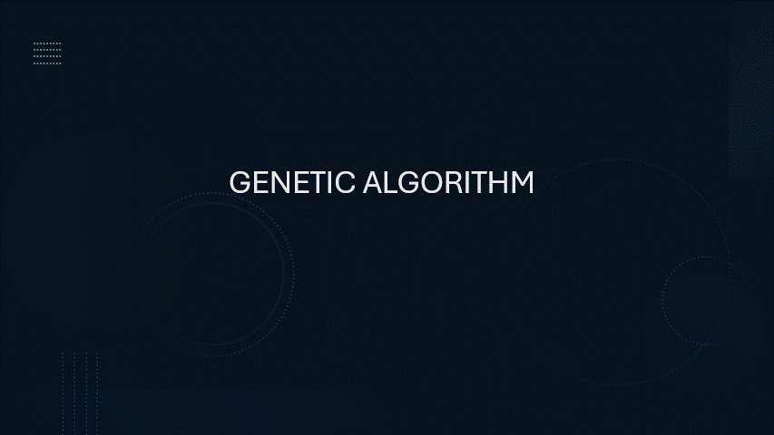

# Report on Genetic Algorithm for Graph Partitioning

## Introduction
Genetic algorithms are optimization techniques inspired by the process of natural selection. They are widely used in solving complex optimization problems, including graph partitioning. The provided Python code implements a genetic algorithm for graph partitioning, specifically designed for a two-way partition.

## Algorithm Overview
1. **Population Initialization:** The algorithm starts by creating an initial population of partitions. Each partition represents a potential solution to the graph partitioning problem.
   
2. **Fitness Evaluation:** The fitness of each partition is evaluated using the `evaluate_partition` function. This function calculates the cut size, which is the number of edges crossing the partitions. The lower the cut size, the better the partition.
   
3. **Selection:** Parents for the next generation are selected based on their fitness scores. Individuals with lower cut sizes have a higher chance of being selected.
   
4. **Crossover:** Crossover is performed on selected parents to generate new individuals (children). The crossover point is randomly chosen, and partitions are swapped beyond that point.
   
5. **Mutation:** There is a 10% chance of mutation for each child. Mutation involves swapping two random nodes within the partition. Additionally, there is a 50% chance of a second mutation.
   
6. **Replacement:** The two least fit individuals in the population are replaced by the new children.
   
7. **Logging:** The algorithm logs the best cut size at regular intervals during the generations. The logged data is saved to a file in the "Logs" directory.
   
8. **Termination:** The algorithm runs for a specified number of generations, and the best partition found is returned.

## Complexity Analysis
Since the algorithm goes over every node for every edge, the time complexity of the algorithm is influenced by the number of vertices (V), edges (E). The overall complexity is approximately O(V * E) per generation.

## Pros and Cons
### Pros
1. **Global Search:** Genetic algorithms are capable of exploring a large solution space, allowing them to find global optima.
2. **Adaptability:** The algorithm can adapt to various problem spaces without requiring problem-specific knowledge.
3. **Parallelization:** Genetic algorithms can be parallelized, potentially improving performance on parallel architectures.

### Cons
1. **No Guarantee of Global Optimum:** There is no guarantee that the algorithm will find the global optimum, as it relies on probabilistic methods.
2. **Parameter Sensitivity:** Performance may be sensitive to parameter values (e.g., mutation rate, population size), requiring careful tuning.
3. **Luck-based:** Convergence speed is mostly based on luck.

## Conclusion
The provided genetic algorithm demonstrates its effectiveness in solving the graph partitioning problem. It combines elements of selection, crossover, and mutation to iteratively improve partition quality over generations. However, users should be mindful of parameter tuning and the computational cost associated with larger graphs.

## Code Optimization Disclaimer
Please note that the provided Python code for the genetic algorithm may not be optimized for performance. It was primarily developed for demonstration purposes to showcase the basic implementation of the algorithm for graph partitioning.
